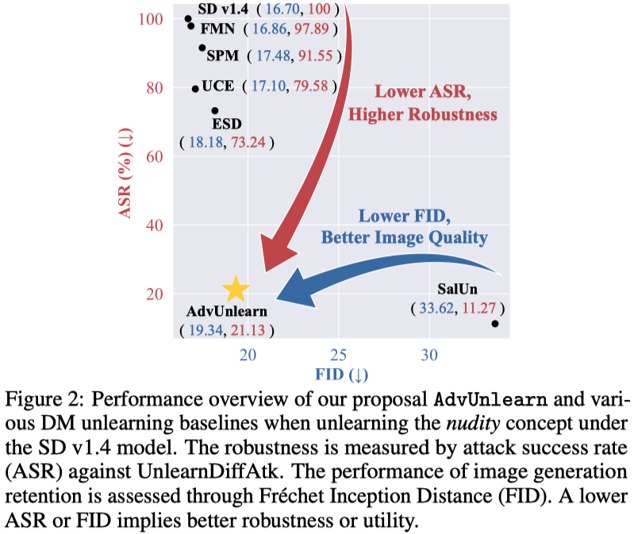

<div align="center">
      
# [NeurIPS 2024] <br> Defensive Unlearning with Adversarial Training <br> for Robust Concept Erasure in Diffusion Models

<div align="left">
      
###  [Arxiv Preprint](https://arxiv.org/abs/2405.15234) | [Fine-tuned Weights](https://drive.google.com/drive/folders/1Nf-EJ2W3CsZwpc5blZFi7tm7o1wEiTg4?usp=sharing) | [HF Model](https://huggingface.co/OPTML-Group/AdvUnlearn) | [Unlearned DM Benchmark](https://huggingface.co/spaces/Intel/UnlearnDiffAtk-Benchmark) | [Demo](https://huggingface.co/spaces/Intel/AdvUnlearn) <br>
Our proposed robust unlearning framework, AdvUnlearn, enhances diffusion models' safety by robustly erasing unwanted concepts through adversarial training, achieving an optimal balance between concept erasure and image generation quality. 

This is the code implementation of our Robust DM Unlearning Framework: ```AdvUnlearn```, and we developed our code based on the code base of [SD](https://github.com/CompVis/stable-diffusion) and [ESD](https://github.com/rohitgandikota/erasing).

<div align='center'>
      
</div>

## Simple Usage of AdvUnlearn Text Encoders ([HuggingFace Model](https://huggingface.co/OPTML-Group/AdvUnlearn))

```
from transformers import CLIPTextModel
cache_path = ".cache"
```

#### Base model of our unlearned text encoders
```
model_name_or_path = "CompVis/stable-diffusion-v1-4"

text_encoder = CLIPTextModel.from_pretrained(model_name_or_path, subfolder="text_encoder", cache_dir=cache_path)
```

#### AdvUnlearn (Ours): Unlearned text encoder
```
model_name_or_path = "OPTML-Group/AdvUnlearn"

# Nudity-Unlearned
text_encoder = CLIPTextModel.from_pretrained(model_name_or_path, subfolder="nudity_unlearned", cache_dir=cache_path)

# Style-Unlearned
text_encoder = CLIPTextModel.from_pretrained(model_name_or_path, subfolder="vangogh_unlearned", cache_dir=cache_path)

# Object-Unlearned
text_encoder = CLIPTextModel.from_pretrained(model_name_or_path, subfolder="church_unlearned", cache_dir=cache_path)
text_encoder = CLIPTextModel.from_pretrained(model_name_or_path, subfolder="garbage_truck_unlearned", cache_dir=cache_path)
text_encoder = CLIPTextModel.from_pretrained(model_name_or_path, subfolder="parachute_unlearned", cache_dir=cache_path)
text_encoder = CLIPTextModel.from_pretrained(model_name_or_path, subfolder="tench_unlearned", cache_dir=cache_path)
```


## Download ckpts from [Google Drive](https://drive.google.com/drive/folders/1Nf-EJ2W3CsZwpc5blZFi7tm7o1wEiTg4?usp=sharing)

```
pip install gdown

# AdvUnlearn ckpts
gdown --folder https://drive.google.com/drive/folders/1unlyyO1vKkQ_bmwNORRkOdqZbMKTCh8a

# [Baseline ckpts] Nudity
gdown https://drive.google.com/uc?id=1rqsy0IzrRiYfhd7WSZ1-TX3xRz9PzqPl

# [Baseline ckpts] Style
gdown https://drive.google.com/uc?id=1oP4Ie5ruiMpDFfn7VExAsAfOoi6MxD99

# [Baseline ckpts] Objects
gdown https://drive.google.com/uc?id=1lxv6PULX6_3M7Uc79AXqy3OMA8oKfyci
```


## Prepare

### Environment Setup
A suitable conda environment named ```AdvUnlearn``` can be created and activated with:

```
conda env create -f environment.yaml
conda activate AdvUnlearn
```

### Files Download
* Base model - SD v1.4: download it from [here](https://huggingface.co/CompVis/stable-diffusion-v-1-4-original/resolve/main/sd-v1-4-full-ema.ckpt), and move it to ```models/sd-v1-4-full-ema.ckpt```
* COCO-10k (for CLIP score and FID): you can extract the image subset from COCO dataset, or you can download it from [here](https://drive.google.com/file/d/1Qgm3nNhp6ykamszN_ZvofvuzjryTsPHB/view?usp=sharing). Then, move it to `data/imgs/coco_10k`

<br>

## Code Implementation

### Step 1: AdvUnlearn [Train]

#### Hyperparameters: 
* Concept to be unlearned: `--prompt`    (e.g., 'nudity')
* Trainable module within DM: `--train_method`
* Attack generation strategy : `--attack_method`
* Number of attack steps for the adversarial prompt generation: `--attack_step`
* Adversarial prompting strategy: `--attack_type`  ('prefix_k', 'replace_k' ,'add')
* Retaining prompt dataset: `--dataset_retain`
* Utility regularization parameter: `--retain_loss_w`

#### a) Command Example: Multi-step Attack
```
python train-scripts/AdvUnlearn.py --attack_init random --attack_step 30 --retain_train 'reg' --dataset_retain 'coco_object' --prompt 'nudity' --train_method 'text_encoder_full' --retain_loss_w 0.3
```

#### b) Command Example: Fast AT variant
```
python train-scripts/AdvUnlearn.py --attack_method fast_at --attack_init random --attack_step 30 --retain_train 'reg' --dataset_retain 'coco_object' --prompt 'nudity' --train_method 'text_encoder_full'   --retain_loss_w 0.3
```

### Step 2: Attack Evaluation [Robustness Evaluation] 
Follow the instruction in [UnlearnDiffAtk](https://github.com/OPTML-Group/Diffusion-MU-Attack) to implement attacks on DMs with ```AdvUnlearn``` text encoder for robustness evaluation.


### Step 3: Image Generation Quality Evaluation [Model Utility Evaluation]
Generate 10k images for FID & CLIP evaluation 

```
bash jobs/fid_10k_generate.sh
```  

Calculate FID & CLIP scores using [T2IBenchmark](https://github.com/boomb0om/text2image-benchmark)

```
bash jobs/tri_quality_eval.sh
```   

<br>


## Checkpoints
ALL CKPTs for different DM unleanring tasks can be found [here](https://drive.google.com/drive/folders/1Nf-EJ2W3CsZwpc5blZFi7tm7o1wEiTg4?usp=sharing).
### 
| DM Unlearning Methods | Nudity  | Van Gogh  | Objects |
|:-------|:----:|:-------:| :-------:|
| [ESD](https://github.com/rohitgandikota/erasing) (Erased Stable Diffusion)  | ✅  | ✅   | ✅ 
| [FMN](https://github.com/SHI-Labs/Forget-Me-Not) (Forget-Me-Not)  | ✅ | ✅   | ✅ 
| [AC](https://github.com/nupurkmr9/concept-ablation) (Ablating Concepts)  | ❌ | ✅   | ❌ 
| [UCE](https://github.com/rohitgandikota/unified-concept-editing) (Unified Concept Editing)  | ✅  |  ✅  |  ❌
| [SalUn](https://github.com/OPTML-Group/Unlearn-Saliency) (Saliency Unlearning)  | ✅  | ❌ |  ✅ 
| [SH](https://github.com/JingWu321/Scissorhands_ex) (ScissorHands)  | ✅  | ❌  | ✅ 
| [ED](https://github.com/JingWu321/EraseDiff) (EraseDiff)  | ✅  | ❌  | ✅ 
| [SPM](https://github.com/Con6924/SPM) (concept-SemiPermeable Membrane)   | ✅  | ✅   | ✅ 
| **AdvUnlearn (Ours)**  | ✅  | ✅   |  ✅ 


<br>


## Cite Our Work
The preprint can be cited as follows:
```
@article{zhang2024defensive,
  title={Defensive Unlearning with Adversarial Training for Robust Concept Erasure in Diffusion Models},
  author={Zhang, Yimeng and Chen, Xin and Jia, Jinghan and Zhang, Yihua and Fan, Chongyu and Liu, Jiancheng and Hong, Mingyi and Ding, Ke and Liu, Sijia},
  journal={arXiv preprint arXiv:2405.15234},
  year={2024}
}
```


